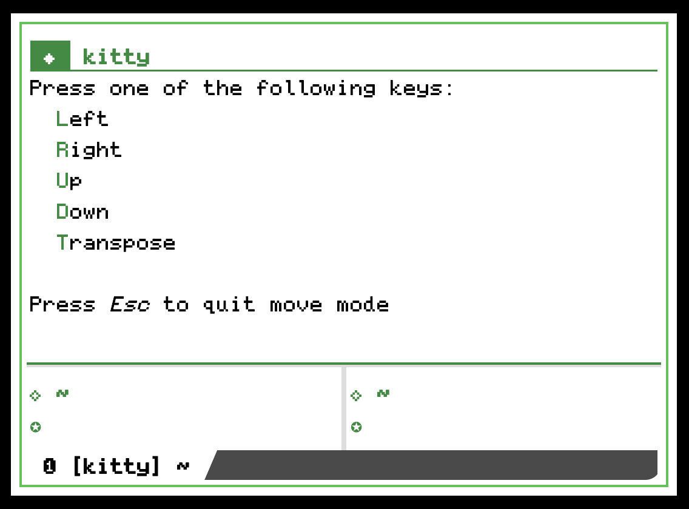

# kitty-imove

Interactive window management overlay for [kitty](https://sw.kovidgoyal.net/kitty/), similar to the built-in resize mode (`kitty_mod+r`).



Press a shortcut to open the overlay, then use letter keys to manipulate the active window:

| Key | Action |
|-----|--------|
| `l` | Move left |
| `r` | Move right |
| `u` | Move up |
| `d` | Move down |
| `t` | Transpose (rotate split orientation) |
| `esc` / `q` | Quit |

## Requirements

- kitty >= 0.46.0
- `allow_remote_control` set to `socket-only` or `yes` in `kitty.conf`

## Installation

Clone this repository:

```sh
git clone https://github.com/cxa/kitty-imove.git ~/.config/kitty/kitty-imove
```

Add to your `kitty.conf`:

```conf
map kitty_mod+m kitten kitty-imove/imove.py
```

Reload kitty config and you're ready to go.

## How it works

Kitty's built-in resize mode provides an interactive overlay for resizing windows, but there is no equivalent for **moving** windows. This kitten fills that gap.

It launches as a TUI overlay using kitty's kitten framework, and communicates with kitty via the FD-based remote control channel — the same mechanism used by built-in kittens. This means it works seamlessly with `allow_remote_control socket-only`, without requiring `allow_remote_control yes`.

## License

MIT
